<p align="center">
  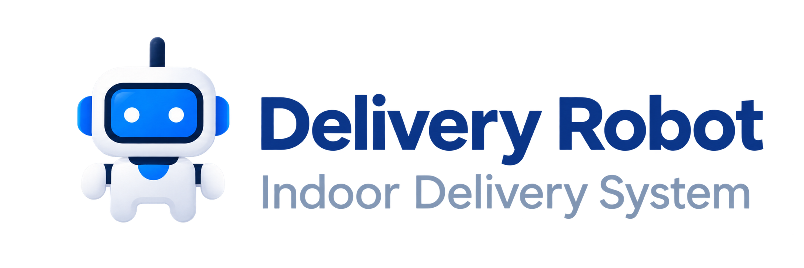
</p>

<h1 align="center">Indoor Delivery Robot Platform</h1>

<p align="center">
  A full-stack control platform for autonomous indoor delivery—connecting a polished user portal and admin control center to ROS 2, Nav2, SLAM, AMCL, Gazebo, and PostgreSQL.
</p>

<p align="center">
  <a href="https://github.com/nattannsra18/indoor-delivery-robot/actions/workflows/ci.yml"></a>
  <a href="LICENSE"></a>
  <a href="https://github.com/nattannsra18/indoor-delivery-robot/releases"></a>
  
  
  
  
  
  
</p>

This project demonstrates an end-to-end autonomous delivery workflow: a user selects pickup and destination stations on a live map, the backend validates and queues the request, and a ROS-connected robot executes the mission while both users and operators receive real-time progress, telemetry, alerts, and audit history.

> **Project status:** feature-complete for the current Gazebo simulation scope. The latest acceptance run covered account approval, sign-in, route planning, queueing, pickup/loading, delivery/unloading, notifications, history, and audit records.

## Video demo

Watch the complete four-minute workflow, including live operations, delivery creation, autonomous Nav2 navigation in Gazebo, task history, station placement, browser-based SLAM mapping, map management, and AMCL localization. The video includes English on-screen explanations and a clearly labeled `17x` mapping time-lapse.

<p align="center">
  <a href="https://youtu.be/Shvci3hzZfk" title="Watch the Indoor Delivery Robot platform demo on YouTube">
    
  </a>
</p>

<p align="center">
  <strong><a href="https://youtu.be/Shvci3hzZfk">Watch the full demo on YouTube →</a></strong>
</p>

<p align="center"><sub>Recorded from the live Gazebo and ROS 2 simulation environment. No hardware telemetry is simulated as physical sensor data.</sub></p>

## Engineering highlights

| Capability | What it demonstrates |
| --- | --- |
| Real robotics integration | Live occupancy grids, AMCL pose, Nav2 paths, mission feedback, diagnostics, and velocity control flow through a dedicated ROS bridge. |
| Product-focused UX | Separate bilingual experiences for delivery users and operators, with map-first task creation and clear queue/arrival estimates. |
| Mapping and localization | Administrators can inventory and activate maps, create new maps with SLAM, set an initial pose, and run assisted global relocalization from the browser. |
| Operational safety | Role-based controls, a software emergency stop, dead-man teleoperation, alerts, task recovery, and a persistent audit log. |
| Full-stack engineering | Next.js and TypeScript on the frontend, FastAPI and SQLAlchemy on the backend, and PostgreSQL for durable operational state. |

## Product tour

### Live operations in one view

The control center combines safety, robot availability, simulated charge, live pose, mission control, and the ROS occupancy grid. This capture shows `TASK-123` navigating to its pickup station with live Nav2 progress and motion telemetry.

<p align="center">
  <a href="docs/images/operations-dashboard.png">
    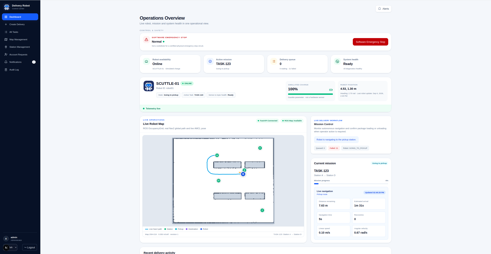
  </a>
</p>

### Map-first delivery workflow

Pickup and destination selection, the Nav2 route preview, distance, travel time, queue state, and estimated completion are presented before a delivery is submitted.

<p align="center">
  <a href="docs/images/create-delivery.png">
    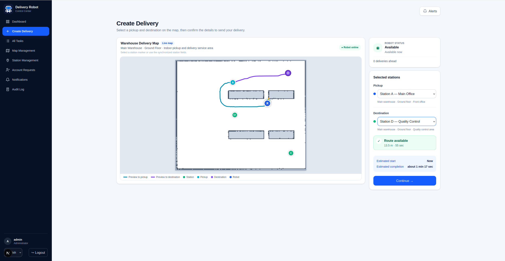
  </a>
</p>

### Task operations and traceability

Operators can search and filter the complete delivery history, perform stage-specific actions, open task details, and inspect an event-by-event timeline with source attribution and stage durations.

<p align="center">
  <a href="docs/images/all-tasks.png">
    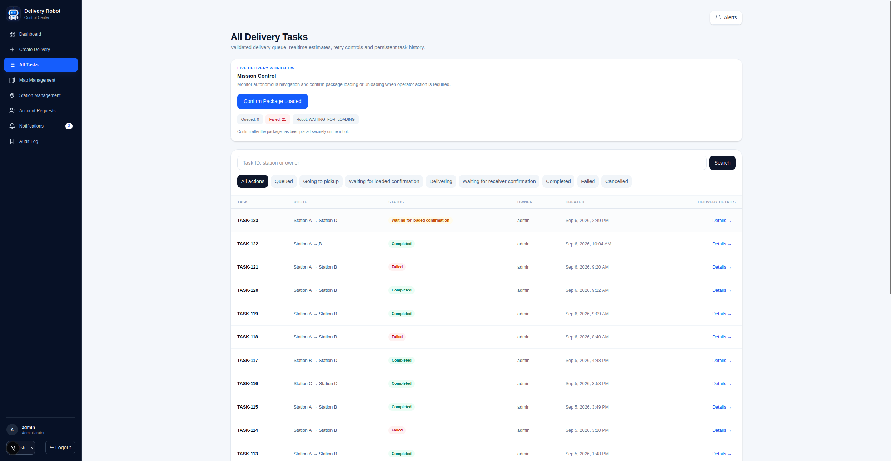
  </a>
</p>

<details>
  <summary><strong>Open a completed delivery event timeline</strong></summary>
  <br />
  <p align="center">
    <a href="docs/images/task-event-history.png">
      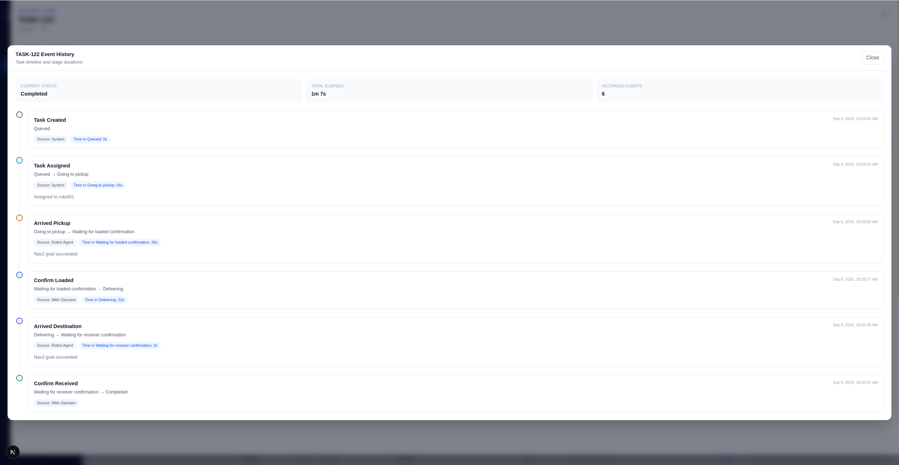
    </a>
  </p>
</details>

### ROS diagnostics and integration health

Detailed sensor and topic diagnostics expose LiDAR, odometry, velocity commands, RGB camera, ArUco detection, and AMCL health. Integration status keeps the web, database, ROS bridge, localization, Nav2, and diagnostic stream visible in the same operational surface.

<p align="center">
  <a href="docs/images/diagnostics-integrations.png">
    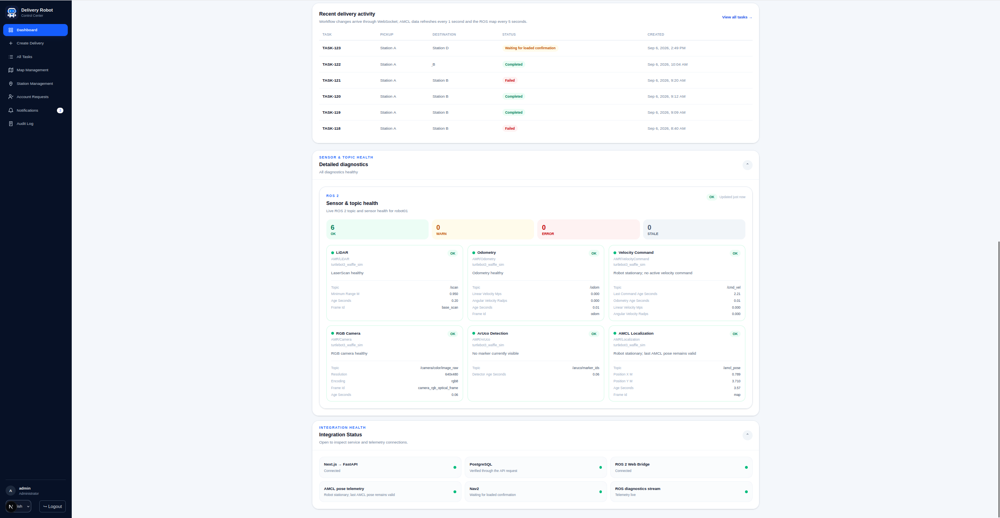
  </a>
</p>

### Robot-backed mapping

The map library reflects the robot filesystem as its source of truth. A new occupancy map can be built with SLAM while an operator drives from the browser using dead-man controls, keyboard input, and adjustable speed.

| Map library | Live web mapping |
| --- | --- |
| [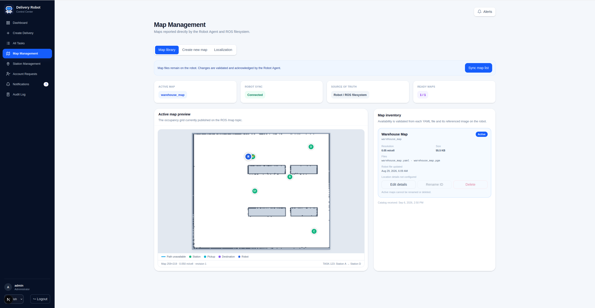](docs/images/map-library.png) | [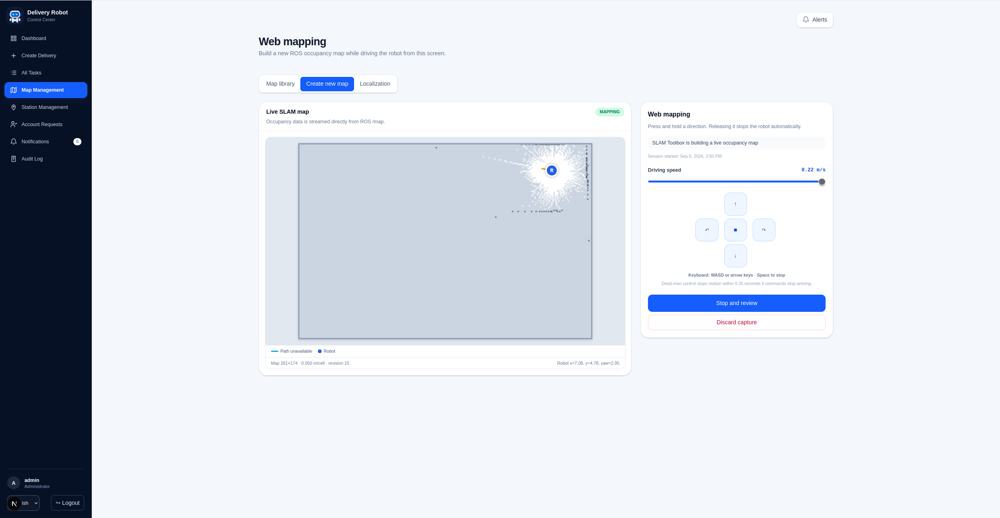](docs/images/web-mapping.png) |

### Localization and station placement

Routine AMCL localization can be managed without RViz: inspect localization health, set an initial pose by dragging a heading on the map, or start global relocalization. Delivery stations are tied to a selected robot map and can also be positioned and oriented interactively.

<p align="center">
  <a href="docs/images/robot-localization.png">
    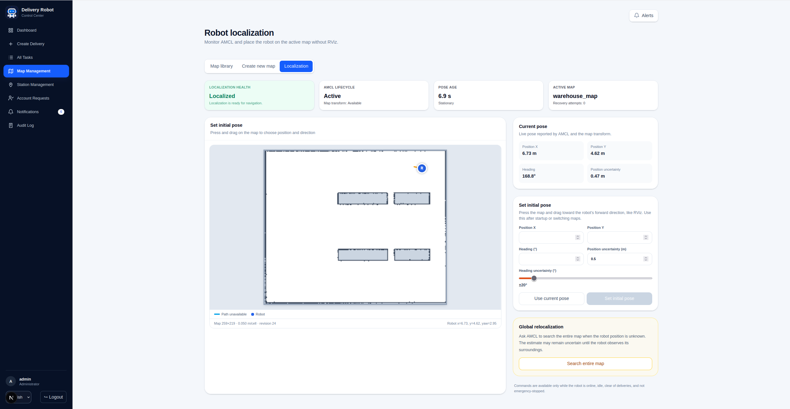
  </a>
</p>

<details>
  <summary><strong>Open visual station management</strong></summary>
  <br />
  <p align="center">
    <a href="docs/images/station-management.png">
      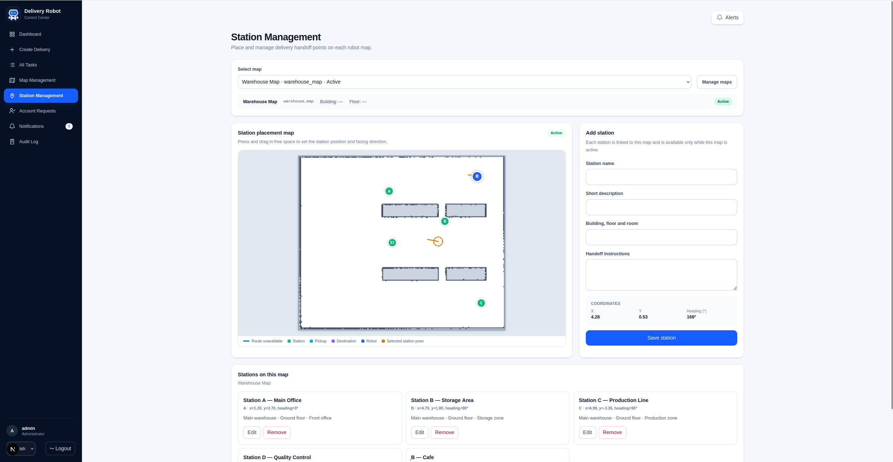
    </a>
  </p>
</details>

<p align="center"><sub>Captured from the running Gazebo and ROS 2 integration environment.</sub></p>

## Product vision

The platform is designed for campus and facility delivery scenarios; `v0.4.0` demonstrates that workflow in the Gazebo simulation environment.

<p align="center">
  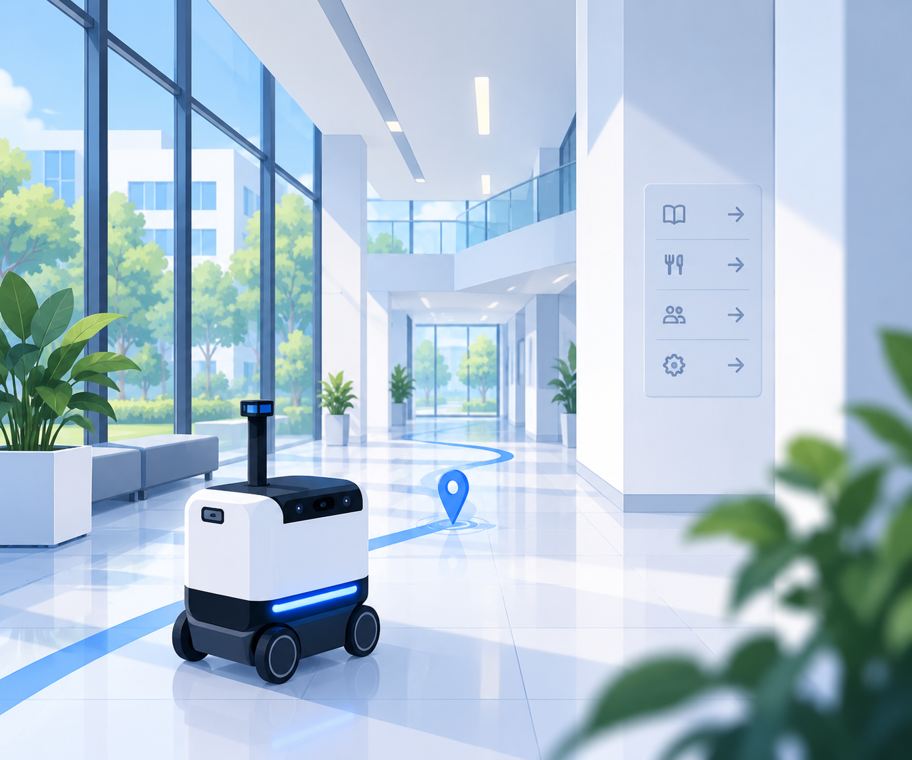
</p>

## System architecture

<p align="center">
  <a href="docs/architecture.svg">
    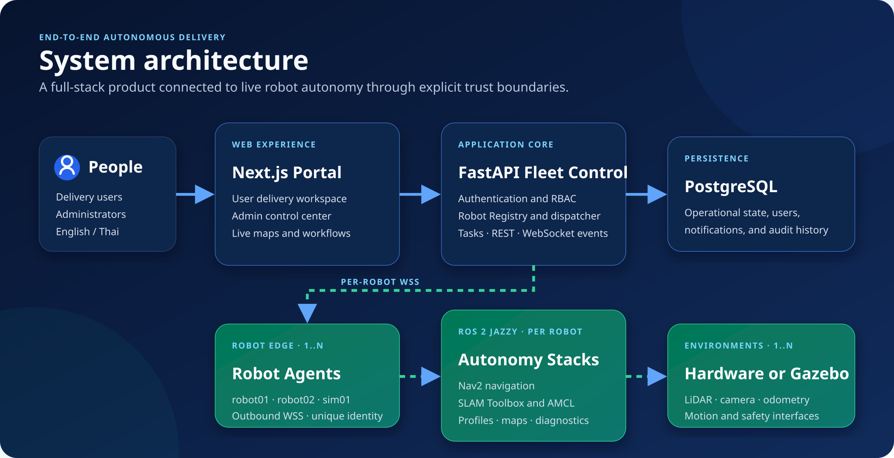
  </a>
</p>

<p align="center"><sub>Open the diagram to inspect the full-resolution architecture.</sub></p>

The web platform lives in this repository. Robot-side ROS 2 packages, simulation assets, Nav2 integration, and the WebSocket bridge live in the companion repository: [amr-navigation-vision-diagnostics](https://github.com/nattannsra18/amr-navigation-vision-diagnostics).

## Product experience

### User portal

- Create a delivery from a live, map-first interface.
- Select pickup and destination stations directly on the map.
- Preview the real Nav2 route, distance, travel time, queue position, and estimated start/completion.
- Confirm delivery details in a focused review flow.
- Follow live robot position, task progress, and delivery notifications.
- Keep each user's deliveries and queue details private from other users.
- Switch between English and Thai throughout the experience.

### Admin control center

- Monitor robot availability, current mission, queue health, alerts, diagnostics, and integrations from one operations dashboard.
- Manage all deliveries with search, filters, task details, cancellation, and retry controls.
- Review account requests and approve access before a new user can command the robot.
- Manage robot-hosted map inventory, metadata, active-map switching, rename, and deletion.
- Start a SLAM session, drive the robot with on-screen or keyboard controls, tune speed, review the live map, and save it to the robot.
- Set the robot's initial pose by clicking and dragging a heading on the map.
- Run global relocalization with manual or automatic scan motion and monitor localization quality.
- Place and edit stations visually on the selected map.
- Inspect grouped notifications, critical alerts, and a persistent audit trail.

## Delivery lifecycle

<p align="center">
  <a href="docs/delivery-workflow.svg">
    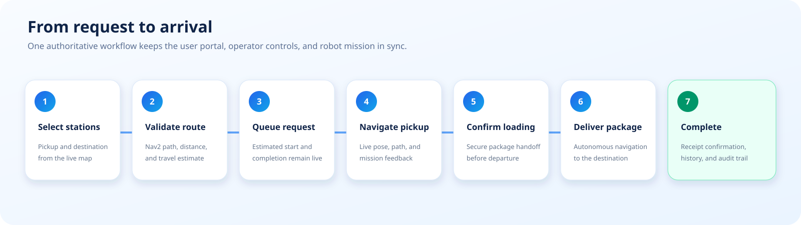
  </a>
</p>

<p align="center"><sub>Open the diagram to inspect the full-resolution delivery lifecycle.</sub></p>

The backend owns the delivery state machine and queue. Browser clients receive authoritative updates through WebSocket events, while the Robot Agent is the only client allowed to publish navigation feedback, map data, telemetry, and mission results.

## Live data and simulation boundaries

The application intentionally distinguishes real system values from simulation-only values:

- Position, velocity, laser scans, maps, Nav2 paths, mission state, and diagnostics originate from ROS 2.
- Delivery state, users, notifications, queue projections, and audit records are persisted by FastAPI and PostgreSQL.
- Battery is identified as simulated while running in Gazebo; the UI does not present it as physical hardware telemetry.
- A software emergency stop is an operational control and **does not replace a certified physical emergency-stop circuit**.

## Quick start

### Prerequisites

- Ubuntu with ROS 2 Jazzy, Nav2, SLAM Toolbox, Gazebo, and `colcon`
- Node.js 22+
- Python 3.12+
- Docker with Docker Compose
- `tmux`

Keep the web and ROS repositories next to each other:

```text
workspace/
├── indoor-delivery-robot/
└── amr-navigation-vision-diagnostics/
```

### 1. Install the web stack

```bash
git clone https://github.com/nattannsra18/indoor-delivery-robot.git
git clone https://github.com/nattannsra18/amr-navigation-vision-diagnostics.git

cd indoor-delivery-robot
cp .env.local.example .env.local
cp backend/.env.example backend/.env
npm ci

python3 -m venv backend/.venv
backend/.venv/bin/pip install -r backend/requirements.txt
docker compose up -d postgres
```

Set a strong `BOOTSTRAP_ADMIN_PASSWORD`, a limited `ROBOT_ENROLLMENT_TOKEN`, and the transitional simulator `ROBOT_WS_TOKEN` in `backend/.env`. Keep `SESSION_COOKIE_SECURE=false` only for local HTTP development; use `true` behind HTTPS. New agents use secure per-robot pairing described in [Robot Agent Protocol v1](docs/agent-protocol-v1.md); disable `ALLOW_LEGACY_ROBOT_TOKEN` after the simulator agent has migrated.

### 2. Build the Robot Agent

```bash
cd ../amr-navigation-vision-diagnostics
source /opt/ros/jazzy/setup.bash
colcon build --packages-select amr_web_bridge --symlink-install
```

### 3. Start the complete simulation

```bash
cd ../indoor-delivery-robot
./scripts/run_dev_stack.sh
./scripts/run_dev_stack.sh status
```

Open [http://localhost:3000](http://localhost:3000). The stack script starts the frontend, FastAPI, Gazebo/Nav2, Gazebo GUI, and the ROS bridge in a managed `tmux` session.

```bash
./scripts/run_dev_stack.sh attach
./scripts/run_dev_stack.sh logs
./scripts/run_dev_stack.sh stop
```

See [Development guide](docs/DEVELOPMENT.md) for configuration, individual service commands, testing, and troubleshooting.

## Quality checks

Run the development stack before the browser smoke tests. Install the Chromium runtime once with `npx playwright install chromium`.

```bash
npm run check
npm run build:ci
npx playwright install chromium
npm run test:e2e

cd backend
PYTHONPATH=. PYTEST_DISABLE_PLUGIN_AUTOLOAD=1 ./.venv/bin/python -m pytest -q
```

The current suite contains 73 frontend contract/UX checks and 136 backend tests. Continuous integration runs both suites, zero-warning TypeScript/ESLint validation, a production build, and Chromium smoke tests against a real FastAPI/PostgreSQL stack on every pull request.

## Repository layout

```text
indoor-delivery-robot/
├── .github/workflows/   # Continuous integration
├── backend/             # FastAPI, domain services, persistence, and tests
├── docs/                # Architecture and development documentation
├── public/auth/         # Product artwork and brand assets
├── scripts/             # Full-stack development orchestration
├── src/app/             # Next.js routes for user and admin experiences
├── src/components/      # Shared maps, navigation, dialogs, and controls
├── src/lib/             # API client, localization, policy, and presentation logic
└── tests/               # Frontend contract, UX regression, and Playwright E2E tests
```

## Technology

**Web:** Next.js, React, TypeScript, Tailwind CSS<br />
**Backend:** FastAPI, Pydantic, SQLAlchemy, PostgreSQL, WebSockets<br />
**Robotics:** ROS 2 Jazzy, Nav2, SLAM Toolbox, AMCL, Gazebo<br />
**Operations:** Docker Compose, tmux, GitHub Actions

## Roadmap

- Validate safety and telemetry semantics on physical hardware.
- Add production identity providers, email delivery, and session administration.
- Extend scheduling and fleet coordination to multiple robots.
- Add production observability, deployment automation, and long-duration reliability testing.

## Author

Designed and developed by [nattannsra18](https://github.com/nattannsra18).

## License

Licensed under the [Apache License 2.0](LICENSE).
